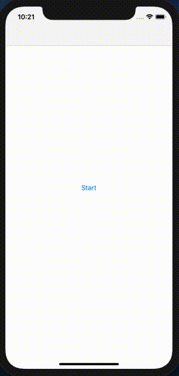

# ModalCardFlow
[](https://cocoapods.org/pods/ModalCardFlow)


A Swift library allows any view controllers are able to start the flow of card views and pass context within flow.



## Installation
You want to add pod `'ModalCardFlow', '~> 1.0'` similar to the following to your Podfile:

```
target 'MyApp' do
  pod 'ModalCardFlow', '~> 1.0'
end
```

Then run a `pod install` inside your terminal.

## Usage
1. Create  a context class and conform it to the protocol `Context`.
```
import Foundation
import ModalCardFlow

class ExampleContext: Context {

    var quantity: Int?

    init(quantity: Int? = nil) {
        self.quantity = quantity
    }

    func update(quantity: Int?) -> ExampleContext {
        return ExampleContext(quantity: quantity)
    }
}
```

2. Create the card class and inheritance from `ModalCard<C: Context>`. Context can be updated to the card by overwriting `func applyContext()`. And the flow can be directed to the next card or previous card by following public methods of `ModalCardFlow`:

```
// Navigation
open func start(with card: Card, andPresentOn vc: UIViewController?)
open func finish(completion: (() -> Void)?)
open func push(card: Card)
open func pop()

// Context
open func update(context: C?)
```

3. Properties of  `ModalCardConfig` contains the UI style of dim view and the card container, page title and its font, and the gestures.
```
dimViewColour: UIColor? = .darkGray,
dimViewAlpha: CGFloat = 0.5,
containerRadius: CGFloat = 1,
containerColour: UIColor? = .white,
title: String? = nil,
titleFont: UIFont? = .boldSystemFont(ofSize: 17),
dragToDismissEnabled: Bool = true
```

4. Initialise the flow by inputing context and the configuration, and then start the flow by presenting the first card.
```
let context = ExampleContext()
let flow = ModalCardFlowFactory.makeFlow(context: context, with: ModalCardConfig())
let parentCard = ParentCard()
flow.start(with: parentCard, andPresentOn: navigationController)
```

* If you would like to create the flow without context, there's a method to use the default context in the factory.
```
let flow = ModalCardFlowFactory.makeFlow(with: ModalCardConfig())
```
